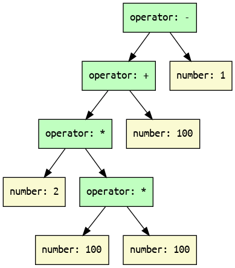

# Simple arithmetic expression

## Monogram

```txt
cos(A) * cos(B) - sin(A) * sin(B)```

## Mermaid diagram


## XML

```xml
<operator name="-">
    <operator name="*">
        <apply kind="parentheses" separator="undefined">
            <identifier name="cos"/>
            <arguments>
                <identifier name="A"/>
            </arguments>
        </apply>
        <apply kind="parentheses" separator="undefined">
            <identifier name="cos"/>
            <arguments>
                <identifier name="B"/>
            </arguments>
        </apply>
    </operator>
    <operator name="*">
        <apply kind="parentheses" separator="undefined">
            <identifier name="sin"/>
            <arguments>
                <identifier name="A"/>
            </arguments>
        </apply>
        <apply kind="parentheses" separator="undefined">
            <identifier name="sin"/>
            <arguments>
                <identifier name="B"/>
            </arguments>
        </apply>
    </operator>
</operator>
```

## JSON

```json
{
    "role": "operator",
    "name": "-",
    "children": [
        {
            "role": "operator",
            "name": "*",
            "children": [
                {
                    "role": "apply",
                    "kind": "parentheses",
                    "separator": "undefined",
                    "children": [
                        {
                            "role": "identifier",
                            "name": "cos"
                        },
                        {
                            "role": "arguments",
                            "children": [
                                {
                                    "role": "identifier",
                                    "name": "A"
                                }
                            ]
                        }
                    ]
                },
                {
                    "role": "apply",
                    "kind": "parentheses",
                    "separator": "undefined",
                    "children": [
                        {
                            "role": "identifier",
                            "name": "cos"
                        },
                        {
                            "role": "arguments",
                            "children": [
                                {
                                    "role": "identifier",
                                    "name": "B"
                                }
                            ]
                        }
                    ]
                }
            ]
        },
        {
            "role": "operator",
            "name": "*",
            "children": [
                {
                    "role": "apply",
                    "kind": "parentheses",
                    "separator": "undefined",
                    "children": [
                        {
                            "role": "identifier",
                            "name": "sin"
                        },
                        {
                            "role": "arguments",
                            "children": [
                                {
                                    "role": "identifier",
                                    "name": "A"
                                }
                            ]
                        }
                    ]
                },
                {
                    "role": "apply",
                    "kind": "parentheses",
                    "separator": "undefined",
                    "children": [
                        {
                            "role": "identifier",
                            "name": "sin"
                        },
                        {
                            "role": "arguments",
                            "children": [
                                {
                                    "role": "identifier",
                                    "name": "B"
                                }
                            ]
                        }
                    ]
                }
            ]
        }
    ]
}
```

## YAML

```yaml
role: operator
name: '-'
children:
- role: operator
  name: '*'
  children:
  - role: apply
    kind: parentheses
    separator: undefined
    children:
    - role: identifier
      name: cos
    - role: arguments
      children:
      - role: identifier
        name: A
  - role: apply
    kind: parentheses
    separator: undefined
    children:
    - role: identifier
      name: cos
    - role: arguments
      children:
      - role: identifier
        name: B
- role: operator
  name: '*'
  children:
  - role: apply
    kind: parentheses
    separator: undefined
    children:
    - role: identifier
      name: sin
    - role: arguments
      children:
      - role: identifier
        name: A
  - role: apply
    kind: parentheses
    separator: undefined
    children:
    - role: identifier
      name: sin
    - role: arguments
      children:
      - role: identifier
        name: B

```

## Graphviz Dot format



