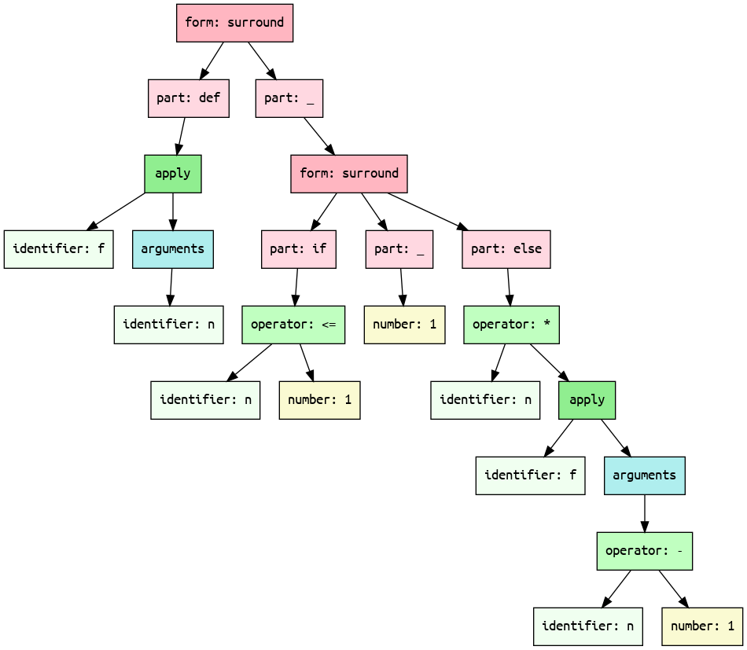

# Recursive factorial function

## Monogram

```txt
# The factorial function in monogram.
def f(n):
    if n <= 1:
        1
    else:
        n * f(n - 1)
    endif
enddef```

## Mermaid diagram


## XML

```xml
<form>
    <part keyword="def">
        <apply kind="parentheses" separator="undefined">
            <identifier name="f"/>
            <arguments>
                <identifier name="n"/>
            </arguments>
        </apply>
    </part>
    <part keyword="_">
        <form>
            <part keyword="if">
                <operator name="&lt;=">
                    <identifier name="n"/>
                    <number value="1"/>
                </operator>
            </part>
            <part keyword="_">
                <number value="1"/>
            </part>
            <part keyword="else">
                <operator name="*">
                    <identifier name="n"/>
                    <apply kind="parentheses" separator="undefined">
                        <identifier name="f"/>
                        <arguments>
                            <operator name="-">
                                <identifier name="n"/>
                                <number value="1"/>
                            </operator>
                        </arguments>
                    </apply>
                </operator>
            </part>
        </form>
    </part>
</form>
```

## JSON

```json
{
    "role": "form",
    "children": [
        {
            "role": "part",
            "keyword": "def",
            "children": [
                {
                    "role": "apply",
                    "kind": "parentheses",
                    "separator": "undefined",
                    "children": [
                        {
                            "role": "identifier",
                            "name": "f"
                        },
                        {
                            "role": "arguments",
                            "children": [
                                {
                                    "role": "identifier",
                                    "name": "n"
                                }
                            ]
                        }
                    ]
                }
            ]
        },
        {
            "role": "part",
            "keyword": "_",
            "children": [
                {
                    "role": "form",
                    "children": [
                        {
                            "role": "part",
                            "keyword": "if",
                            "children": [
                                {
                                    "role": "operator",
                                    "name": "<=",
                                    "children": [
                                        {
                                            "role": "identifier",
                                            "name": "n"
                                        },
                                        {
                                            "role": "number",
                                            "value": 1
                                        }
                                    ]
                                }
                            ]
                        },
                        {
                            "role": "part",
                            "keyword": "_",
                            "children": [
                                {
                                    "role": "number",
                                    "value": 1
                                }
                            ]
                        },
                        {
                            "role": "part",
                            "keyword": "else",
                            "children": [
                                {
                                    "role": "operator",
                                    "name": "*",
                                    "children": [
                                        {
                                            "role": "identifier",
                                            "name": "n"
                                        },
                                        {
                                            "role": "apply",
                                            "kind": "parentheses",
                                            "separator": "undefined",
                                            "children": [
                                                {
                                                    "role": "identifier",
                                                    "name": "f"
                                                },
                                                {
                                                    "role": "arguments",
                                                    "children": [
                                                        {
                                                            "role": "operator",
                                                            "name": "-",
                                                            "children": [
                                                                {
                                                                    "role": "identifier",
                                                                    "name": "n"
                                                                },
                                                                {
                                                                    "role": "number",
                                                                    "value": 1
                                                                }
                                                            ]
                                                        }
                                                    ]
                                                }
                                            ]
                                        }
                                    ]
                                }
                            ]
                        }
                    ]
                }
            ]
        }
    ]
}
```

## YAML

```yaml
role: form
children:
- role: part
  keyword: def
  children:
  - role: apply
    kind: parentheses
    separator: undefined
    children:
    - role: identifier
      name: f
    - role: arguments
      children:
      - role: identifier
        name: n
- role: part
  keyword: _
  children:
  - role: form
    children:
    - role: part
      keyword: if
      children:
      - role: operator
        name: <=
        children:
        - role: identifier
          name: n
        - role: number
          value: 1
    - role: part
      keyword: _
      children:
      - role: number
        value: 1
    - role: part
      keyword: else
      children:
      - role: operator
        name: '*'
        children:
        - role: identifier
          name: n
        - role: apply
          kind: parentheses
          separator: undefined
          children:
          - role: identifier
            name: f
          - role: arguments
            children:
            - role: operator
              name: '-'
              children:
              - role: identifier
                name: n
              - role: number
                value: 1

```

## Graphviz Dot format



