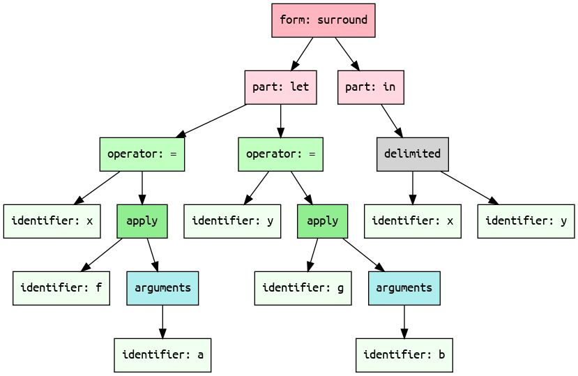

# Let Expression


## Monogram

This example shows how you might simulate `let` expressions in Monogram:

```txt
let x = f(a)
    y = g(b)
in:
    (x, y)
endlet

```

## Mermaid diagram

We can target Mermaid's flowchart as an output format. 
And this is what it looks like:


## XML

```xml
<form syntax="surround">
  <part keyword="let">
    <operator syntax="infix" name="=">
      <identifier name="x" />
      <apply kind="parentheses" separator="undefined">
        <identifier name="f" />
        <arguments>
          <identifier name="a" />
        </arguments>
      </apply>
    </operator>
    <operator name="=" syntax="infix">
      <identifier name="y" />
      <apply kind="parentheses" separator="undefined">
        <identifier name="g" />
        <arguments>
          <identifier name="b" />
        </arguments>
      </apply>
    </operator>
  </part>
  <part keyword="in">
    <delimited separator="comma" kind="parentheses">
      <identifier name="x" />
      <identifier name="y" />
    </delimited>
  </part>
</form>
```

## JSON

We can target JSON as an output format. The format of each node is
a bit verbose but straightforward:

```json
{
    "role": "{{NODE NAME}}",
    "ATTRIBUTE_1": "VALUE_1", 
    ... 
    "ATTRIBUTE_N": "VALUE_N",
    "children": [ 
        ...
    ]
}
```

And this is what it expands into:

```json
{
  "role": "unit",
  "src": "let.mg",
  "children": [
    {
      "role": "form",
      "syntax": "surround",
      "children": [
        {
          "role": "part",
          "keyword": "let",
          "children": [
            {
              "role": "operator",
              "syntax": "infix",
              "name": "=",
              "children": [
                {
                  "role": "identifier",
                  "name": "x"
                },
                {
                  "role": "apply",
                  "separator": "undefined",
                  "kind": "parentheses",
                  "children": [
                    {
                      "role": "identifier",
                      "name": "f"
                    },
                    {
                      "role": "arguments",
                      "children": [
                        {
                          "role": "identifier",
                          "name": "a"
                        }
                      ]
                    }
                  ]
                }
              ]
            },
            {
              "role": "operator",
              "syntax": "infix",
              "name": "=",
              "children": [
                {
                  "role": "identifier",
                  "name": "y"
                },
                {
                  "role": "apply",
                  "kind": "parentheses",
                  "separator": "undefined",
                  "children": [
                    {
                      "role": "identifier",
                      "name": "g"
                    },
                    {
                      "role": "arguments",
                      "children": [
                        {
                          "role": "identifier",
                          "name": "b"
                        }
                      ]
                    }
                  ]
                }
              ]
            }
          ]
        },
        {
          "role": "part",
          "keyword": "in",
          "children": [
            {
              "role": "delimited",
              "kind": "parentheses",
              "separator": "comma",
              "children": [
                {
                  "role": "identifier",
                  "name": "x"
                },
                {
                  "role": "identifier",
                  "name": "y"
                }
              ]
            }
          ]
        }
      ]
    }
  ]
}```

## YAML

We can target YAML as an output format. The format of each node is
a bit verbose but easy to understand.

```yaml
role": "{{NODE NAME}}",
ATTRIBUTE_1: VALUE_1,
...
children": 
- ...
- ...
```

And this is what it expands into:


```yaml
role: form
syntax: surround
children:
- role: part
  keyword: let
  children:
  - role: operator
    syntax: infix
    name: '='
    children:
    - role: identifier
      name: x
    - role: apply
      kind: parentheses
      separator: undefined
      children:
      - role: identifier
        name: f
      - role: arguments
        children:
        - role: identifier
          name: a
  - role: operator
    name: '='
    syntax: infix
    children:
    - role: identifier
      name: y
    - role: apply
      kind: parentheses
      separator: undefined
      children:
      - role: identifier
        name: g
      - role: arguments
        children:
        - role: identifier
          name: b
- role: part
  keyword: in
  children:
  - role: delimited
    separator: comma
    kind: parentheses
    children:
    - role: identifier
      name: x
    - role: identifier
      name: y

```

## Graphviz Dot format



